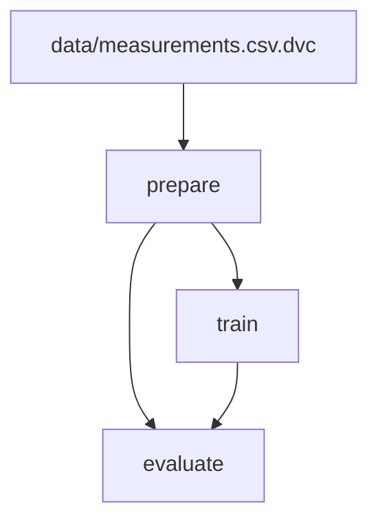

# Week 4 Lab: Reference Solution

The complete, runnable version of the Week 4 lab. Instructors can use it to verify student
submissions; students get it after the deadline.

## Changes from starter

| File | Exercise | What changed |
| --- | --- | --- |
| `.dvc/config`, `.dvc/.gitignore`, `.dvcignore` | 1 | Created by `dvc init --subdir`, then the Silo remote and four `dvc config` settings added |
| `data/raw/batch_01.csv` … `batch_03.csv` | 2, 4 | Copied from `data/incoming/` by `make next-batch`, and committed |
| `src/week_04_dvc_introduction/datasets.py` | 2 | `build_measurements` implemented: it merges the batches in `data/raw/` in name order, with no index column and LF line endings |
| `data/measurements.csv.dvc`, `data/.gitignore` | 2, 4 | Created by `dvc add` |
| `dvc.yaml` | 5 | `train` and `evaluate` stages declared |
| `dvc.lock`, `data/processed/.gitignore`, `models/.gitignore` | 5 | Created by `dvc repro` |
| `metrics/metrics.json`, `models/mlflow_run_id.json` | 5, 6 | `cache: false` outputs, so they are committed to Git |
| `src/week_04_dvc_introduction/dvc_link.py` | 6, 7 | `log_data_version` and `log_dataset_input` implemented (Exercise 6); `require_data_added` implemented (Exercise 7) |
| `tests/*` | 2–7 | `@pytest.mark.skip` markers removed |
| `compose.yaml` | — | `name: week04-dvc-introduction` (the starter uses `-starter`, so the two never share volumes) |

Everything else is identical to the starter: `mlflow.Dockerfile`, `bootstrap.sh`,
`config.py`, `data.py`, `model.py`, `pipeline.py`, `dvc_meta.py`, `tracking.py`,
`registry.py`, `cli.py`, `params.yaml`, `Makefile`, `.env.example` and `.gitattributes`.

## Running the solution

```bash
# 1. Stop any other lab stack: they all use the 55xx host ports
cd ../../week-03-mlflow-integration/solution && docker compose down; cd -

# 2. Dependencies (uv.lock is committed)
uv sync --locked --all-groups
cp .env.example .env      # then set MLFLOW_MODEL_OWNER to your name

# 3. Rebuild the DVC-tracked dataset from the three batches in data/raw/.
#    A fresh clone has no DVC cache, so it rebuilds the file instead of pulling it.
make build-data
uv run python src/main.py verify-data   # workspace matches pointer: True

# 4. Bring up the stack (creates both Silo buckets)
make up

# 5. Add and push the data, run the pipeline, register, promote, trace
make all
```

Output of `make all` on fresh volumes. The MLflow `INFO` and `WARNING` lines, the run
links and the `uv run` echo lines are left out:

```
Built the dataset from 3 batch(es) (batch_01.csv, batch_02.csv, batch_03.csv): 768 rows
  path : data/measurements.csv
  md5  : a8fd7b4f0d6d1bc4e378a8f76c5fff0c

WARNING: Some of the cache files do not exist neither locally nor on remote. Missing cache files:
md5: c0893fb60844c5f31b0f5b7c2e9df865
md5: 7aecd1c6733dccc194f38c9c2778c461
md5: d9eba76cf921c13f5af2032d09a12f35
1 file pushed
'data/measurements.csv.dvc' didn't change, skipping
Running stage 'prepare':
> uv run python src/main.py prepare
prepare: 768 rows -> 576 train / 192 test
Updating lock file 'dvc.lock'

Running stage 'train':
> uv run python src/main.py train
train: wrote .../models/model.pkl
  MLflow run    : 105f2a46043348709db1d584e8fc1cc3
  MLflow digest : 2857c4e0
  DVC md5       : a8fd7b4f0d6d1bc4e378a8f76c5fff0c

Updating lock file 'dvc.lock'

Running stage 'evaluate':
> uv run python src/main.py evaluate
evaluate:
{
  "accuracy": 0.7656,
  "precision": 0.72,
  "recall": 0.5373,
  "f1": 0.6154,
  "roc_auc": 0.8183
}
  metrics also logged to MLflow run 105f2a46043348709db1d584e8fc1cc3

Updating lock file 'dvc.lock'
Use `dvc push` to send your updates to remote storage.
Successfully registered model 'diabetes-classifier'.
Created version '1' of model 'diabetes-classifier'.
Registered diabetes-classifier version 1
  source run: 105f2a46043348709db1d584e8fc1cc3

Version 1 now carries aliases: ['champion', 'staging']

── Traceability chain ──
1. Model URI    : models:/diabetes-classifier@staging
2. Version      : 1  (aliases: ['champion', 'staging'])
3. Run          : 105f2a46043348709db1d584e8fc1cc3  (dvc-logreg)
4. Git commit   : d8752f6
5. Data version : a8fd7b4f0d6d1bc4e378a8f76c5fff0c
   Data location: s3://dvc-storage/dvcstore/files/md5/a8/fd7b4f0d6d1bc4e378a8f76c5fff0c
6. Params:
{
      "model_family": "logreg", "C": "1.0", "max_iter": "1000",
      "random_seed": "42", "test_size": "0.25", "n_rows_train": "576"
}
```

The warning about missing cache files is expected on a fresh clone. The pipeline outputs
that `dvc.lock` names do not exist yet when `make all` pushes the data; `make repro`
creates them a moment later.

`register` also prints a warning that is expected, and that you know from Week 3:
`Run with id ... has no artifacts at artifact path 'model', registering model based on
models:/m-... instead`. MLflow 3 stores a logged model outside the run's artifact folder,
so the `runs:/<run_id>/model` form resolves through it.
`runs:/` is a readability choice, not a correctness one: the source run is named in the call.
On `mlflow==3.13.0` the `models:/m-<id>` URI that `log_model` returns records
`ModelVersion.run_id` too (measured), and that `run_id` is the link `make trace` walks.

## Expected output: dataset versions (seed 42)

| Version | Content | Rows | Bytes | md5 |
| --- | --- | --- | --- | --- |
| 1 | `batch_01.csv` | 461 | 19,034 | `786c54f2770fa1e7ea5438e6e44b6486` |
| 2 | `batch_01.csv` + `batch_02.csv` | 568 | 23,462 | `66f7fa4dbbf8fd83503d8537d3aa990c` |
| 3 | all three batches | 768 | 31,750 | `a8fd7b4f0d6d1bc4e378a8f76c5fff0c` |

The md5s are the same on every machine. `build_measurements` merges the batches in name
order, writes no index column (`index=False`) and uses LF line endings.
`tests/test_datasets.py::test_committed_pointer_names_all_three_batches` rebuilds version 3
and checks it against the committed pointer.

**Version 3 holds the same 768 rows as `data/diabetes.csv`, but it scores differently.**
This is expected, and it is the second written question of Exercise 5. The rows of version
3 are in the order the batches arrived, so the stratified split selects different rows.

| | Week 1-3 pins (`diabetes.csv`) | Week 4 v3 (`measurements.csv`) |
| --- | --- | --- |
| accuracy | 0.7344 | **0.7656** |
| f1 | 0.5785 | **0.6154** |

`tests/test_smoke.py` still checks the Week 1-3 pins against `diabetes.csv`.

## Expected output: `make repro`

First run: every stage runs.

```
Running stage 'prepare':
> uv run python src/main.py prepare
prepare: 768 rows -> 576 train / 192 test
Generating lock file 'dvc.lock'
Updating lock file 'dvc.lock'

Running stage 'train':
> uv run python src/main.py train
train: wrote models/model.pkl
Updating lock file 'dvc.lock'

Running stage 'evaluate':
> uv run python src/main.py evaluate
Updating lock file 'dvc.lock'
Use `dvc push` to send your updates to remote storage.
```

Second run: nothing changed, so nothing runs.

```
'data/measurements.csv.dvc' didn't change, skipping
Stage 'prepare' didn't change, skipping
Stage 'train' didn't change, skipping
Stage 'evaluate' didn't change, skipping
Data and pipelines are up to date.
```

Change `train.C` to `0.1` in `params.yaml` and run again: `prepare` skips, and `train` and
`evaluate` run. DVC knows this because `dvc.lock` stores the param values. `dvc metrics diff`
then shows:

```
Path                  Metric     HEAD    workspace    Change
metrics/metrics.json  accuracy   0.7656  0.7552       -0.0104
metrics/metrics.json  f1         0.6154  0.5913       -0.0241
metrics/metrics.json  precision  0.72    0.7083       -0.0117
metrics/metrics.json  recall     0.5373  0.5075       -0.0298
metrics/metrics.json  roc_auc    0.8183  0.8199       0.0016
```

`dvc metrics show` with `C` back at `1.0`:

```
Path                  accuracy    f1      precision    recall    roc_auc
metrics/metrics.json  0.7656      0.6154  0.72         0.5373    0.8183
```

## The pipeline graph

`make dag` prints both forms. The mermaid form renders in Markdown:



The `.dvc` pointer file is a node too: the versioned dataset is the root of the graph.

## Where the data lives in Silo

`make up` creates two buckets. Measured with `mc ls --recursive` after `make all`.

**`dvc-storage`** holds one object per unique file content. The object names are hashes,
not file names. `dvcstore/` is the `DVC_REMOTE_PATH` prefix. The hash is split after two
characters, so no folder gets millions of entries:

```
dvcstore/files/md5/7a/ecd1c6733dccc194f38c9c2778c461    1.9KiB   models/model.pkl
dvcstore/files/md5/a8/fd7b4f0d6d1bc4e378a8f76c5fff0c     31KiB   data/measurements.csv
dvcstore/files/md5/c0/893fb60844c5f31b0f5b7c2e9df865    7.9KiB   data/processed/test.csv
dvcstore/files/md5/d9/eba76cf921c13f5af2032d09a12f35     23KiB   data/processed/train.csv
```

The right-hand column is not in the bucket. It comes from `dvc.lock`, which maps names to
hashes. After `make all`, only the dataset object is in Silo; run `make dvc-push` to upload
the three pipeline outputs, and `dvc status --cloud` then reports
`Cache and remote 'storage' are in sync`. The four md5s are the same on every machine.

**`mlflow-artifacts`** holds the MLflow side, by experiment id. In MLflow 3 a logged model
is stored outside the run's artifact folder, under `<experiment_id>/models/m-<32hex>/`:

```
1/models/m-346bb827145b40b290091f2f73b1a691/artifacts/MLmodel             684B
1/models/m-346bb827145b40b290091f2f73b1a691/artifacts/conda.yaml         3.9KiB
1/models/m-346bb827145b40b290091f2f73b1a691/artifacts/model.pkl          1.5KiB
1/models/m-346bb827145b40b290091f2f73b1a691/artifacts/python_env.yaml     107B
1/models/m-346bb827145b40b290091f2f73b1a691/artifacts/requirements.txt   3.2KiB
```

MLflow creates a new `m-<32hex>` for every logged model, so **yours will differ**. The DVC
hashes above do not: MLflow's id names the event that produced the file, and DVC's hash
names the content.

The artifact is `model.pkl` because `mlflow.sklearn.log_model` in 3.13.0 uses `cloudpickle`
by default. MLflow **3.15.0** changed the default to `skops`, which renames the file
`model.skops`. Every lab pins `mlflow==3.13.0` in the client and in `mlflow.Dockerfile` for
this reason.

## Expected output: the MLflow link

`make link` forces a new training run on the same data version:

```
Running stage 'train':
  MLflow run    : 04d8927d12544a479fe2371dc02ad730
Running stage 'evaluate':
  metrics also logged to MLflow run 04d8927d12544a479fe2371dc02ad730
'data/measurements.csv.dvc' didn't change, skipping
Stage 'prepare' didn't change, skipping
Stage 'train' didn't change, skipping
Stage 'evaluate' didn't change, skipping
Data and pipelines are up to date.
```

`make runs-for-data` then finds both runs, the one from `make all` and the one from
`make link`, each with its metrics. The filter is `tags.dvc_md5 = '<md5>'`:

```
                          run_id tags.mlflow.runName params.C  metrics.f1 tags.git_commit
04d8927d12544a479fe2371dc02ad730          dvc-logreg      1.0      0.6154         d8752f6
105f2a46043348709db1d584e8fc1cc3          dvc-logreg      1.0      0.6154         d8752f6

  2 run(s).
```

### Why `evaluate` depends on `models/mlflow_run_id.json`

`evaluate` reads this file: it logs the metrics to the run named in it. So the file is a
dependency. Without it in `deps`, the pipeline still runs, but it gives a wrong result:

1. `make link` re-trains. The model is deterministic, so `model.pkl` is byte-identical.
2. All of `evaluate`'s declared inputs are unchanged, so DVC skips it.
3. The new MLflow run has params and tags, but **no metrics**. Before this dependency was
   added, `make runs-for-data` showed its `metrics.f1` as `NaN`.

`dvc repro` reports success the whole time. The rule: **if a stage reads a file, that file
is a dep.** With the dependency in place, a new run id marks `evaluate` as stale, and two
`make repro` runs in a row still skip every stage.

## Expected output: Exercise 7 (optional)

After an edit to `data/measurements.csv` without `dvc add`, a hand-run `train` stops before
it creates an MLflow run:

```
$ uv run python src/main.py train

Cannot run `train` yet:
  measurements.csv has changed since its last `dvc add` (md5 b86d8681d02cbc0738ee7732eee324c7, pointer a8fd7b4f0d6d1bc4e378a8f76c5fff0c). Run `dvc add` and commit the pointer, or restore the file with `dvc checkout --force`.
```

The edit is the one from the README: the first patient's `bmi` from `33.6` to `33.7`. The
check runs only when MLflow is reachable, so the pipeline still runs in CI.

`make repro` does not hit this check. DVC sees the changed file and runs `dvc add` for you,
so the new pointer and the run's tag agree. But that pointer is not committed, and
`dvc status --cloud` shows the new version as `new`: nobody else can get that data until
you commit and push.

## Expected output: tests

| Command | Prerequisites | Result |
| --- | --- | --- |
| `make test` in `solution/` | stack up | **51 passed** |
| `make test` in `solution/` | stack down | **46 passed, 5 skipped** (the `live` tests) |
| `make test` in `starter/` | stack up or down | **26 passed, 25 skipped** |
| `uv run pytest -q` in a fresh `starter/` copy with **no `.env`, no `.dvc/`, no dataset and no Docker** | nothing | **26 passed, 25 skipped**, exit 0 |

The last row is the situation in CI. `config.py` does not check that `measurements_path`
exists, because the DVC-tracked dataset is absent there.

Each of the starter's 25 skips names the exercise that unlocks it:

- 10 wait for a DVC repo, a pointer or a lock file (Exercises 1, 2 and 5);
- 5 wait for `build_measurements` (Exercises 2 and 4);
- 3 wait for the stages in `dvc.yaml` (Exercise 5);
- 5 wait for the MLflow link (Exercise 6);
- 2 wait for `require_data_added` (Exercise 7).

The counts are the same with the stack up and down, because the starter's link tests have
skip markers. In the solution, the five `live` tests run when the stack is up: 46 + 5 = 51.

## Tear-down

```bash
make down      # stop; runs and data stay in the named volumes
make down-v    # stop AND delete the volumes, for a fresh start
```

**After `make down-v`, run `make link` before `make register`.** `down-v` deletes the MLflow
database. But `models/mlflow_run_id.json` and `dvc.lock` still name the old run, and DVC
cannot know that the database was emptied. So `dvc repro` reports the pipeline as up to
date, and `register` fails with `RESOURCE_DOES_NOT_EXIST: Run with id=… not found`.
`make link` forces a new training run, and then `register`, `promote` and `trace` work. A
local pipeline cannot see the state of a remote service. Because the run id is in Git, you
can at least see which run it expects.

---

> Model answers and the grading rubric are kept instructor-only in
> `.agents/grading/week-04.md` (not shipped with student or solution releases).
